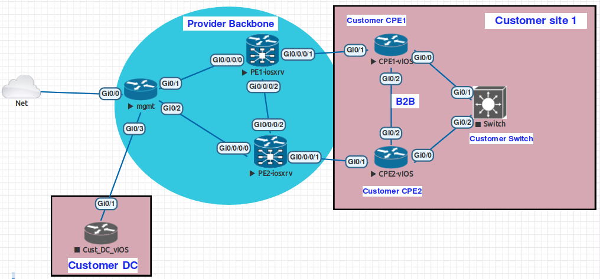

BUILDING NETWORK AUTOMATION SOLUTION HOMEWORKS ;-)

# [NetAutSol] Getting Started (Week #1)

LAB Up And Running !
Diagram from EVE-NG

## EXECUTE RAW COMMANDS

ansible all -i hosts -l MGMT,CPE1,CPE2 -m raw -a "show ip route" >> [RAW COMMAND OUTPUT](./LOGS/RAW_COMMAND.log)

# [NetAutSol] Easy Wins (Week #2) Hands-on Exercises

## 1st PLAYBOOKS

  . Execute commands
  * ansible-playbook [IOS_COMMAND.yml](IOS_COMMAND.yml) -l MGMT,CPE1,CPE2       >> [OUTPUT](./LOGS/IOS_COMMAND.log)

  * ansible-playbook [IOSXR_COMMAND.yml](IOSXR_COMMAND.yml) -l PE1,PE2       >> [OUTPUT](./LOGS/IOSXR_COMMAND.log)

  * ansible-playbook [MULTIVENDOR_COMMAND.yml](MULTIVENDOR_COMMAND.yml)    >> [OUTPUT](./LOGS/MULTIVENDOR_COMMAND.log)

  . Execute commands and save output in file
  * ansible-playbook [MULTIVENDOR_COMMAND_AND_SAVE_FILE.yml](MULTIVENDOR_COMMAND_AND_SAVE_FILE.yml)    >> [OUTPUT](./LOGS/MULTIVENDOR_COMMAND_AND_SAVE_FILE.log) / [MGMT](./configs/MGMT/MGMT_shrun.txt) / [CPE1](./configs/CPE1/CPE1_shrun.txt) / [CPE2](./configs/CPE2/CPE2_shrun.txt) / [PE1](./configs/PE1/PE1_shrun.txt) / [PE2](./configs/PE2/PE2_shrun.txt)

  * ansible-playbook [NAPALM_CLI.yml](NAPALM_CLI.yml) -l CPE1  >> [OUTPUT](./LOGS/NAPALM_CLI.log) / [CPE1 UGLY](./configs/CPE1/CPE1_napalmcli_ugly.txt) / [CPE1 NICE](./configs/CPE1/CPE1_napalmcli_nice.txt)

  >>  **QUESTION!!!!!!!** how to render nicely NAPALM_CLI OUTPUT  **NOW WORKING !!!!!!!!!!!!!!!! see updated logs below**

   . JINJA2 template
  * ansible-playbook [JINJA2_SNMP_LOCATION.yml](JINJA2_SNMP_LOCATION.yml)    >> [OUTPUT](./LOGS/JINJA2_SNMP_LOCATION.log) / [CPE1](./configs/CPE1/SNMP_LOCATION.conf)

  . NAPALM_INSTALL_CONFIG
  * ansible-playbook [NAPALM_CONFIG.yml](NAPALM_CONFIG.yml) -t install_config   >> [OUTPUT](./LOGS/NAPALM_INSTALL_CONFIG.log)

  * ansible-playbook [NAPALM_CONFIG.yml](NAPALM_CONFIG.yml) -t remove_config   >> [OUTPUT](./LOGS/NAPALM_REMOVE_CONFIG.log)

  . NAPALM_GET_FACTS
  * ansible-playbook [NAPALM_GET_FACTS.yml](NAPALM_GET_FACTS.yml) >> [OUTPUT](./LOGS/NAPALM_GET_FACTS.log)

## PARSING DATA

  . NAPALM_CLI_TELNET + extract interface from sh ip int brief | i X.X.X.X
  * ansible-playbook [NAPALM_CLI_TELNET.yml](NAPALM_CLI_TELNET.yml) -l MGMT -D >> [OUTPUT](./LOGS/NAPALM_CLI_TELNET.log)

  . IOS_COMMAND_AND_REGEXP + extract interface(s) from sh ip int brief (| i X.X.X.X)
  * ansible-playbook [IOS_COMMAND_AND_REGEXP.yml](IOS_COMMAND_AND_REGEXP.yml) -l MGMT -D >> [OUTPUT](./LOGS/IOS_COMMAND_AND_REGEXP.log)

# [NetAutSol] Data Model (Week #3) Hands-on Exercises

## DATA MODEL

  . [Data MODEL used for customer](host_vars/CPE1.yml)
  * 1st part with site common details (cct id, order number, MGMT LB , adress)
  * 2nd part with SUBVPN information as i plan to support multi-vrf

## DETECT PE / PE INTERFACE / PE INTERFACE VLAN and set Facts (+lineinfile module to store these in hostvars yml file for future use)
  . ansible-playbook [GET_DATA_PE.yml](GET_DATA_PE.yml) -l CPE1 -D >> [OUTPUT](./LOGS/GET_DATA_PE.log)

  . ansible-playbook [CONFIG.yml](CONFIG.yml) -l CPE1 -t basic -D >>  [OUTPUT](./LOGS/CONFIG_BASIC.log)

  
