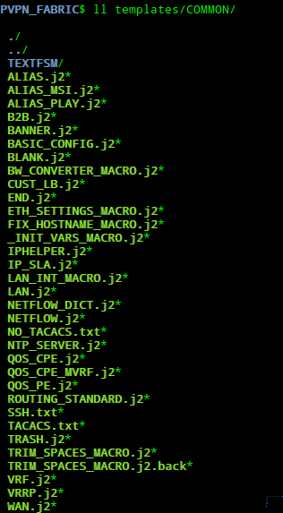

# Putting It All Together

My real life environment is an MPLS network where i wanted to automate Managed Cisco IOS CPEs config/validation for numerous customers that have either standard feature (just a connected LAN to be redistributed to MPLS WAN) tor more complex ones (MultiVrf, QOS, Netflow, IPsla)

### Roles

After week4 hands on exercises, i really jumped into roles structured playbooks as my playbooks had becomes a bit messy and overloaded...

Here's my roles foder today

It has all the features i need during my customer deployment

I have a role that create linux aliases (ALIAS) in order to be able to ssh MGMT LB using nice and readable reference instead of its MGMT LB

There's one that deploys (DEPLOY) configs using Napalm, others that use napalm_get_facts module to get facts on CPEs

Also based on CPE MGMT LB, i'm able to find on which PE / Interface / vlan the CPE is connected to so i can detect PE model (either JunOS, IOS, IOS-XRdevices) so i can create the proper QOS / Shaping config (Role GET_DATA_PE)

All "GET" roles fetch info from devices

IS_ALIVE roles can check LB reachability so that main playbook is run once CPE is installed and LB is reachable. it's basically run every 5 mns using a cron job.

There are the templates roles which create config from jinja2 templates (template + assemble module are used)

And finally "VERIFY" roles that analyse feched data and validate deployment using assert module that triggers roles to send emails after config is validated (EMAIL_IPCFG) or service activation is done (EMAIL_IPTST)

### Templates

I've build common templates that can be reused for all my customers and also specific ones for non standard features

COMMON Folder contains :

Customer folder contains:

### Customer Playbook

Customer Playbook is triggered via a cron job after LB is reachable using "allinone" tag and roles are called 1 after the other

My template Roles will then colect data then create configs 1 by 1 and then assemble all bits of config in a file that will be pushed to CPE using napalm_install_config module in DEPLOY role

Same for PE configs

and finally sanity checks are performed
- is BGP received prefixes > 0
- can we ping HUB site VIP
- is vrrp instance master on primary and backup on sec?
- and so on

If all assertions pass, then confirmation email is sent to delivery team with bunch of details like napalm facts , list of ip interfaces, etc...

FULL LOGs [Here](screens/REAL_LOGS_ANSIBLE) !!!!

Thanks again Ivan for the guidance! not finished yet but promising !

;-)
